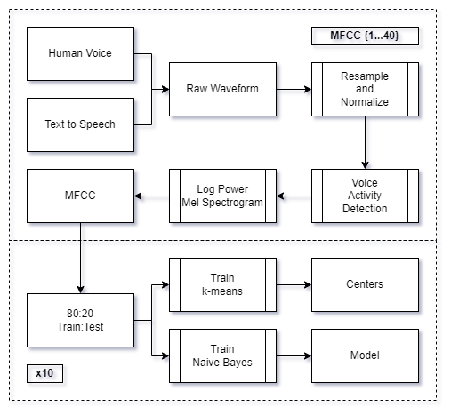
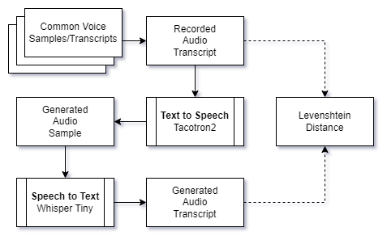
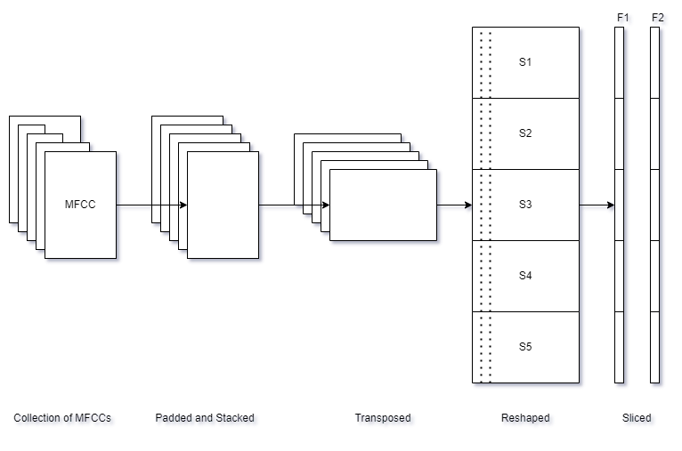
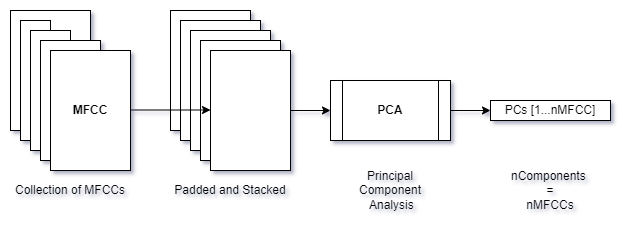

# voice-attack
Leveraging Mel Frequency Cepstral Coefficients to Identify Machine Generated Audio Voice Through K-Means and Naive Bayesian Classification

## Paper
[Leveraging Mel Frequency Cepstral Coefficients to Identify Machine Generated Audio Voice Through K-Means and Naive Bayesian Classification](/daniel_shannon_final_paper.pdf)

## Script Summary

- `utils.py` contains many reusable and helpful functions
- `tts.py` to generate text to speech samples from cv-valid-dev-wav
- `tts_distance_histogram.py` to generate the histogram of the levenshtein distances
- `audio_mfcc.py` to extract MFCC features from audio files
  - `process_audio_mfcc.py` to iterate and extract MFCCs from many audio files
- `k_means.py` to perform k-means on generated and recorded audio for 1 MFCC
  - `process_k_means.py` to run k-means on generated and recorded audio for many MFCCs
- `naive_bayes.py` to perform naive bayes on generated and recorded audio for 1 MFCC
  - `process_naive_bayes.py` to run naive bayes on generated and recorded audio for many MFCCs
- `analyze_kmeans.py` and `analyze_naive_bayes.py` analyzes the results of the respective models and produce performance metrics
- `roc_curve_compare.py` to generate roc curve and comparison scatter chart.

## Audio Files

- `cv-valid-dev/cv-valid-dev-wav.zip`
  - recorded audio samples: `sample-{sample id}.wav`
  - metadata: `cv-valid-dev-wav.csv`
- `audio_generated/tts_final
  - generated audio samples:  `{transcript}.wav`
  - metadata: `results.csv`
  
## MFCCs

*\*available upon request*
MFCCs for recorded and generated samples are saved in `mfcc_recorded.zip` and `mfcc_generated.zip`, respectively.

`mfcc_recorded.zip`:
- `/mfcc_recorded`
  - `/final_{n_mfcc}`
    - `{n}-recorded-mfcc.npy`
    - ...
  - ...

`mfcc_generated.zip:`
- `/mfcc_generated`
  - `/final_{n_mfcc}`
    - `{n}-generated-mfcc.npy`
    - ...
  - ...

## Results
k-means results of testing for generated and recorded samples are located in kmeans_final.zip

`kmeans_final.zip`
- `/kmeans_final`
  - `results_accuracy_means.csv`
  - `results_accuracy.csv`
  - `results_mfcc{n_mfcc}_round{n_round}.csv`

*\*.joblib files are the naive bayes model for that number of mfccs and round*

`naive_bayes_final.zip`
- `/naive_bayes_final`
  - `results_accuracy_means.csv`
  - `results_accuracy.csv`
  - `nb_model_mfcc{n_mfcc}_round{n_round}.joblib`
  - `results_mfcc{n_mfcc}_round{n_round}.csv`

## Experiment Design

*Experiment Design*

*TTS-STT design*

*K-means transformation design*

*Naive Bayes PCA transformation design*

